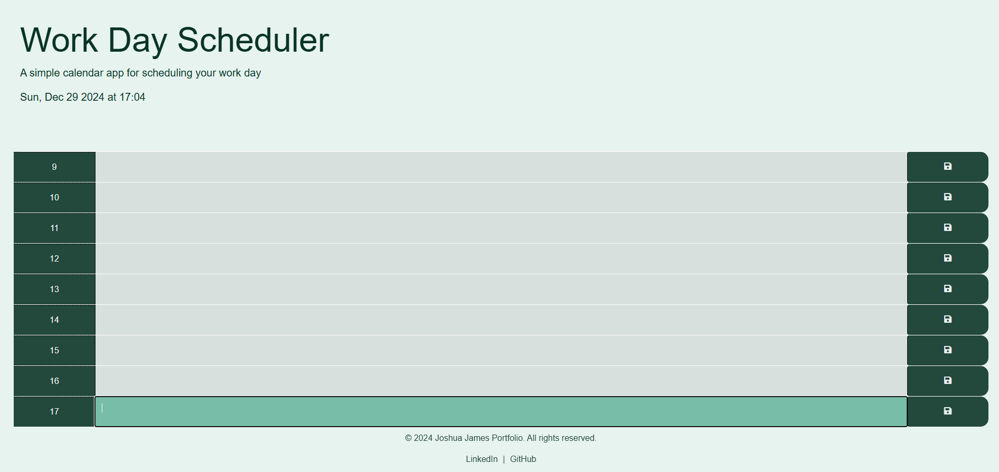

## Work Day Scheduler

## Description 

Create a simple calendar application that allows a user to save events for each hour of a typical working day (9am&ndash;5pm) This app will run in the browser and feature dynamically updated HTML and CSS powered by jQuery.

ill be using use the [Day.js](https://day.js.org/en/) library to work with date and time. 

## Table of Contents 

- [Description](#description)
- [Languages](#languages)
- [Usage](#usage)

## Languages

- HTML
- Css
- jQuery
- JavaScript

## Usage
-  Vist [GitHub Repo]
- User clicks on slots on the color-coded calendar and edits the events.
